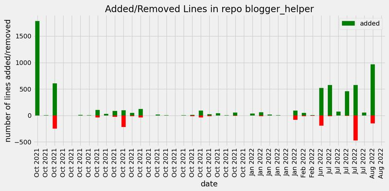
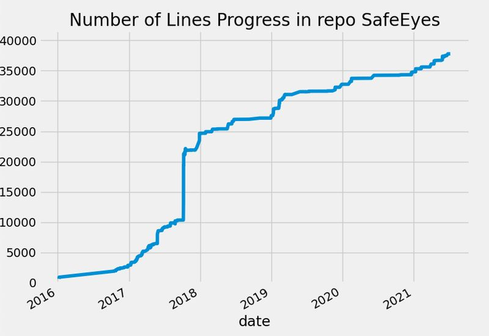

# Git commits graph

Display plot of changes in repo - count of lines or changed lines

## Installation

Use pip to install the package:
```sh
$ pip3 install git-commits-graph
```
or pipx to install in isolated environment:
```sh
$ pipx install git-commits-graph
```

## Usage
plot timeline of both added and removed lines in your repo:
```sh
```shell
$ git-commits-graph your-repo-path -c
```


plot lines count evolution in time.
```shell
$ git-commits-graph your-repo-path -t
```

to se all options:
```
$ git-commits-graph --help
```

```
Usage: git-commits-graph [OPTIONS] GIT_DIR

Options:
  -b, --branch TEXT               git repository branch to browse.
  -s, --style TEXT                matplotlib plotting style to use.
  -c, --changes                   plot timeline of both added and removed
                                  lines.
  -t, --total-lines               plot lines count time evolution.
  -g, --aggregate-by TEXT         aggregate by: Y - year, M - month, W - week,
                                  D - day
  -l, --log-scale                 aggregate by day
  -a, --list-available-plot-styles
                                  list available plot styles and exit.
  --help                          Show this message and exit.
```


## Related Projects
[danielfleischer/git-commits-lines-graph](https://github.com/danielfleischer/git-commits-lines-graph) - A small python script to visualize the number of lines in a project, as a function of time.

## License

[MIT](https://izikeros.mit-license.org/) © [Krystian Safjan](https://safjan.com).
